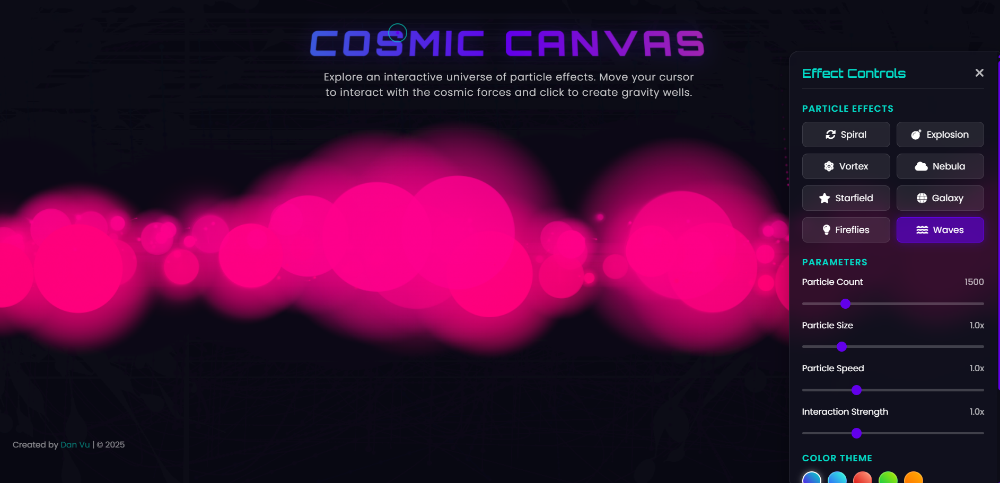

# Cosmic Canvas: Interactive Particle Universe

## Overview
Cosmic Canvas is an immersive web experience that creates stunning, interactive particle effects. Users can explore and interact with different particle systems that mimic cosmic phenomena like galaxies, nebulae, and star fields.

## Features
- **8 Unique Particle Effects**: Spiral, Explosion, Vortex, Nebula, Starfield, Galaxy, Fireflies, and Waves
- **Real-time Interaction**: Move your cursor to interact with the particles and click to create gravity wells
- **Customizable Parameters**: Adjust particle count, size, speed, and interaction strength
- **Special Effects**: Toggle glow, trails, physics, and fade animations
- **Color Themes**: Choose from Purple, Blue, Red, Green, and Gold themes
- **Custom Cursor**: Enhanced visual feedback through a custom cursor system
- **Responsive Design**: Optimized for various screen sizes

## Technologies Used
- HTML5
- CSS3 (with custom animations and transitions)
- JavaScript (vanilla, no frameworks)
- HTML5 Canvas for rendering

## How to Use
1. Visit the [live demo](https://) or clone the repository and open index.html
2. Move your cursor around to interact with the particles
3. Click and hold to create gravity wells and other effects
4. Use the control panel (gear icon) to customize the experience
5. Experiment with different particle effects and settings

## Performance Notes
- For the best experience, use a modern browser with hardware acceleration
- Particle count is automatically adjusted based on screen size and device performance
- Consider reducing particle count on lower-end devices

## Credits
Created by [danvufs](https://www.linkedin.com/in/danducvu) | © 2025

## License
[MIT License](LICENSE)